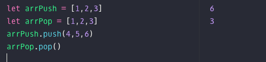
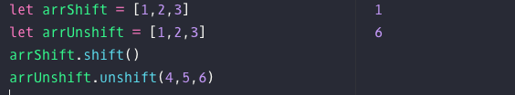

# 重读《JavaScript 高级程序设计（第 3 版）》

## 第 5 章-引用类型

::: tip
ECMA 从技术上讲是一门面向对象的语言，**但是**不具备传统的面向对象语言支持的类和接口
:::

### 创建 Object 实例的方法

- 使用 new 操作符+Object 构造函数

```js
var yayxs = new Object();
yayxs.name = `yayxs`;
yayxs.age = 18;
```

- 对象字面量表示法

```js
var yayxs = {
  //这个花括号表示字面量的开始
  name: `yayxs`,
  age: 18, // 在最后一个属性后添加逗号，会在IE7及更早版本导致错误
};
```

或者

```js
var yayxs = {
  name: "yayxs",
  age: 18,
  6: true,
};
```

### 创建数组 Array

- 使用 Array 构造函数
  其中 new 是可以省略的

```js
var colors = new Array(10); // 这个数量会变成length

var colors = new Array("red", "blue"); // 这个数量会变成length
```

- 数组字面量 []

### 数组的 length

利用数组的`length`属性可以很方便往数组后边增加一个新的元素

```js
var colors = [`red`, `blue`];
colors[colors.length] = `yellow`;
```

### 检测数组

为了确定某个对象是不是对象的经典问题
对于一个**网页**，**全局作用域**，使用`instanceof` 操作符

```js
if (val instanceof Array) {
  // 对数组进行操作
}
```

那么问题是，它假定只有一个全局执行环境，假如网页中包含多个框架，那么就存在了两个以上不同的全局执行环境，从而存在两个以上不同版本的 Array 构造函数...

那么为了解决这个问题呢，ECMA5 新增了`Array.isArray()`

### push()、pop()

栈：后进先出的数据结构

<!--  -->


队列：先进先出

### unshift() vs shift()

<!--  -->

