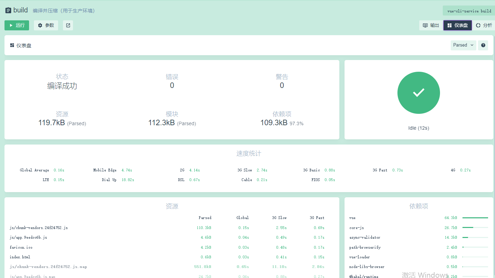
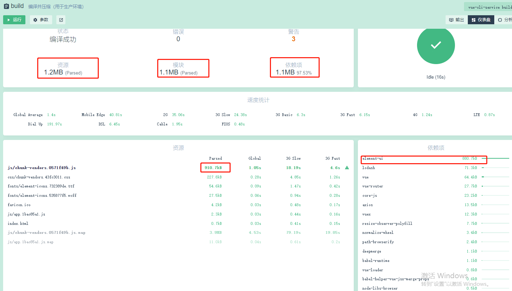
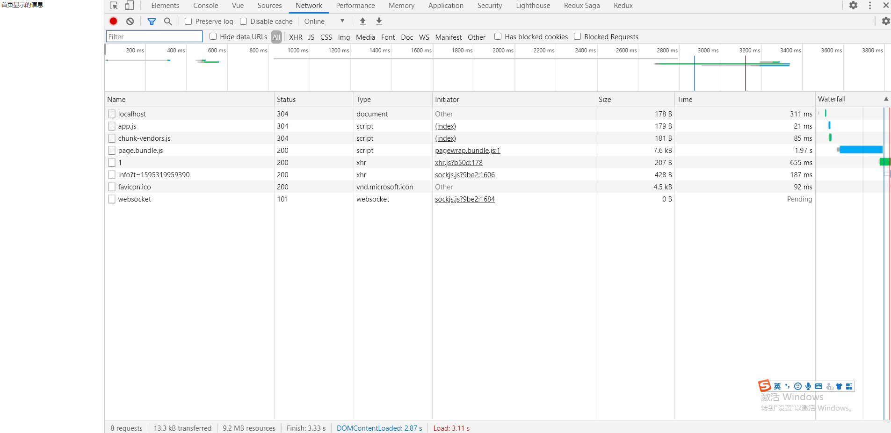
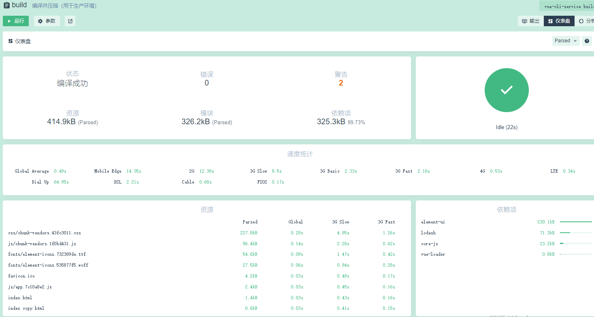

# Vue 项目 性能优化 首屏加载优化

首先通过一个简单的案例，打包构建一下 `npm run build` 这是最初的项目（构建完事）


<!--  -->

在禁用浏览器的缓存 网络状态 调整到 Fast 3G 情况下 加载完成需要 13.63 红色爆炸.

接着安装项目中常用的库 包括不限于`ele` `vuex` `vue-router` `axios` `loadsh` 等等.再看下打包的效果

这是我们在`main.js` 中的使用情况,并且在`App.vue` 中使用 `axios` 以及 `loadsh`

```js
import Vue from "vue";
import App from "./App.vue";
import VueRouter from "vue-router";
import Vuex from "vuex";
import ElementUI from "element-ui";
import "element-ui/lib/theme-chalk/index.css";
Vue.config.productionTip = false;
Vue.use(VueRouter);
Vue.use(ElementUI);
Vue.use(Vuex);
new Vue({
  render: (h) => h(App),
}).$mount("#app");
```

接着我们再 `build` 一下 看下


<!--  -->

我们紧接着 打开页面 发现确实出现首页白屏，大约 3 秒才


<!--  -->

我们基本没写什么代码，却加载如此之慢

## vue.config.js

```js
/**
 * 可选的配置文件
 */

const CompressionWebpackPlugin = require("compression-webpack-plugin"); // 开启 GZip 压缩
const externals = {
  vue: "Vue",
  "vue-router": "VueRouter",
  vuex: "Vuex",
  axios: "axios",
  "element-ui": "ELEMENT",
  _: "lodash",
};

// cnd 配置
const cdn = {
  // 开发环境
  dev: {
    css: [
      "https://cdnjs.cloudflare.com/ajax/libs/element-ui/2.4.7/theme-chalk/index.css",
    ],
    js: [],
  },
  // 生产环境
  build: {
    css: [
      "https://cdnjs.cloudflare.com/ajax/libs/element-ui/2.4.7/theme-chalk/index.css",
    ],
    js: [
      "https://cdn.bootcss.com/vue/2.5.17/vue.min.js",
      "https://cdn.bootcss.com/vue-router/3.0.1/vue-router.min.js",
      "https://cdn.bootcss.com/vuex/3.0.1/vuex.min.js",
      "https://cdn.bootcss.com/axios/0.18.0/axios.min.js",
      "https://cdn.bootcss.com/lodash.js/4.17.11/lodash.min.js",
      "https://cdnjs.cloudflare.com/ajax/libs/element-ui/2.4.7/index.js",
    ],
  },
};

// 是否使用gzip
const productionGzip = true;
// 需要gzip压缩的文件后缀
const productionGzipExtensions = ["js", "css"];
// vue.config.js
module.exports = {
  // 选项...
  productionSourceMap: false, // 如果你不需要生产环境的 source map，可以将其设置为 false 以加速生产环境构建 默认 true
  /**
   *如果这个值是一个函数，则会接收被解析的配置作为参数。
   该函数既可以修改配置并不返回任何东西，也可以返回一个被克隆或合并过的配置版本。
   https://cli.vuejs.org/zh/guide/webpack.html#%E7%AE%80%E5%8D%95%E7%9A%84%E9%85%8D%E7%BD%AE%E6%96%B9%E5%BC%8F
   */
  configureWebpack: (config) => {
    const myConfig = {}; // 定义一个我的配置
    if (process.env.NODE_ENV === "production") {
      // 为生产环境修改配置... 生产环境 npm 包 转 cdn
      myConfig.externals = externals;

      myConfig.plugins = [];
      // 构建时开启gzip,降低服务器压缩对CPU资源的占用,服务器也要相应开启gzip
      productionGzip &&
        myConfig.plugins.push(
          new CompressionWebpackPlugin({
            test: new RegExp(
              "\\.(" + productionGzipExtensions.join("|") + ")$"
            ),
            threshold: 10240,
            minRatio: 0.8,
          })
        );
    } else {
      // 为开发环境修改配置...
      /**
       * 关闭host check,方便使用ngrok之类的内网转发工具
       */
      myConfig.devServer = {
        disableHostCheck: true,
      };
    }
    return myConfig; // 返回新的配置
  },
  /**
   * 是一个函数，会接收一个基于 webpack-chain 的 ChainableConfig 实例。
   * 允许对内部的 webpack 配置进行更细粒度的修改。
   */
  chainWebpack: (config) => {
    config.plugins.delete("prefetch");

    config.plugin("html").tap((args) => {
      if (process.env.NODE_ENV === "production") {
        args[0].cdn = cdn.build;
      }
      if (process.env.NODE_ENV === "development") {
        args[0].cdn = cdn.dev;
      }
      return args;
    });
  },
};
```

可以看到压缩后


<!--  -->

## index.html

```html
<!DOCTYPE html>
<html lang="en">
  <head>
    <meta charset="utf-8" />
    <meta http-equiv="X-UA-Compatible" content="IE=edge" />
    <meta name="viewport" content="width=device-width,initial-scale=1.0" />
    <link rel="icon" href="<%= BASE_URL %>favicon.ico" />
    <title>demo</title>
    <!-- 使用CDN加速的CSS文件,配置在vue.config.js下 -->
    <% for (var i in
    htmlWebpackPlugin.options.cdn&&htmlWebpackPlugin.options.cdn.css) { %>
    <link
      href="<%= htmlWebpackPlugin.options.cdn.css[i] %>"
      rel="preload"
      as="style"
    />
    <link href="<%= htmlWebpackPlugin.options.cdn.css[i] %>" rel="stylesheet" />
    <% } %>
  </head>

  <body>
    <noscript>
      <strong
        >We're sorry but demo doesn't work properly without JavaScript enabled.
        Please enable it to continue.</strong
      >
    </noscript>
    <div id="app"></div>
    <!-- 使用CDN加速的JS文件,配置在vue.config.js下 -->
    <% for (var i in
    htmlWebpackPlugin.options.cdn&&htmlWebpackPlugin.options.cdn.js) { %>
    <script src="<%= htmlWebpackPlugin.options.cdn.js[i] %>"></script>
    <% } %>
    <!-- built files will be auto injected -->
  </body>
</html>
```
