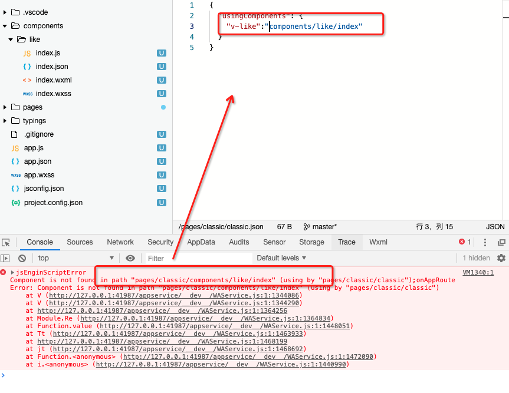

## 大坑小坑

- 小程序在引入自定义组件的时候，`绝对路径`时加个`/`

<!--  -->



```js
{
  "usingComponents": {
    "v-like": "/components/like/index"
  }
}
// 或者
{
  "usingComponents": {
    "v-like": "../../components/like/index"
  }
}
```

- 全局样式是会影响到 pages

## 优质小程序接口封装

```js
import { config } from "../config";
const tips = {
  1005: `appkey无效`,
  1: `出现错误`,
};

class HTTP {
  request(params) {
    const { url, method, data } = params;
    const { api_base_url, appkey } = config;
    wx.request({
      url: api_base_url + url,
      method: method || "GET",
      data,
      header: {
        "content-type": `application/json`,
        appkey,
      },
      success: (res) => {
        let code = res.statusCode.toString();
        if (code.startsWith(`2`)) {
          params.success(res.data);
        } else {
          let {
            data: { error_code },
          } = res;
          this._showError(error_code);
        }
      },
      fail: (err) => {
        this._showError(1);
      },
    });
  }

  _showError(errorCode) {
    if (!errorCode) {
      errorCode = 1;
    }
    wx.showToast({
      title: tips[errorCode],
      icon: "none",
      duration: 2000,
    });
  }
}

export { HTTP };
```
