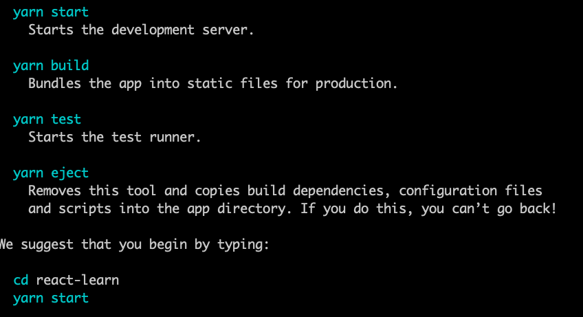
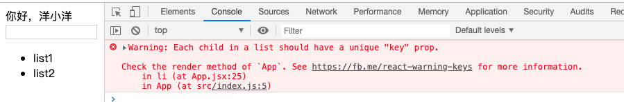
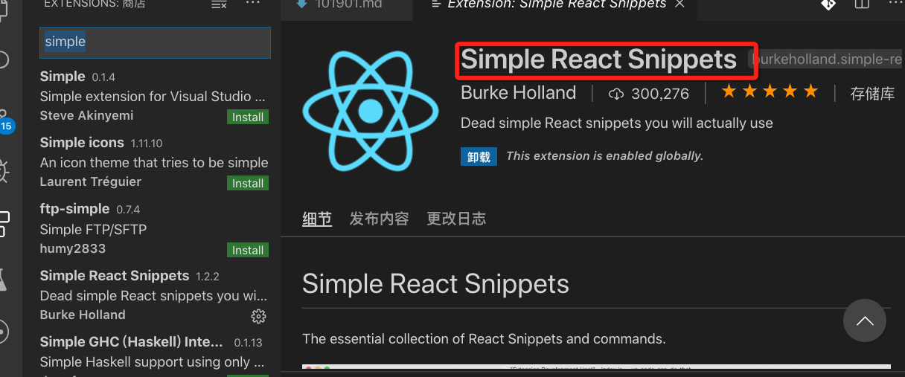
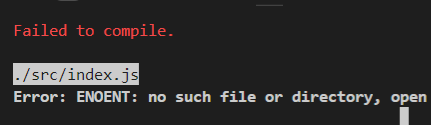

# React 16.X（新版 RC）笔记

## 写在前面

全球最火的前端框架，大厂都在用

### 优点

- 生态强大
- 上手简单
- 社区活跃

### v16.x

#### 三大体系

- React.js
- RN
- React VR

## 搭建 React.js

### 安装脚手架

```js
npm i -g create-react-app
```

### 使用脚手架创建项目

```js
create-react-app react-learn // 项目的名称是react-learn
```

特别需要注意的是，Facebook 创建了 Create React App，该环境预先配置了构建 React 应用所需的一切。它将创建一个实时开发服务器，使用 Webpack 自动编译 React，JSX 和 ES6，自动前缀 CSS 文件，并使用 ESLint 来测试和警告代码中的错误。
之后就要求我们进入项目 然后跑起来项目


### 目录

```
|-- node_modules                    放包的地方
|-- public
|   |-- favicon.ico                 网页标签左上角
|   |-- index.html                  模板文件
|   |-- manifest.json               移动端的配置
|-- |
|-- src                             源文件
|   |-- index.js                    入口文件
|   |-- index.css
|   |-- app.js
|   |-- logo.svg

```

`index.html`容错处理

```html
<noscript>You need to enable JavaScript to run this app.</noscript>
```

`PWA`相关

```js
import * as serviceWorker from "./serviceWorker";
```

## hello world

首先写一个 hello,**App**大写字母开头，自定义组件

```js
import React, { Component } from "react"; // 解构赋值

class App extends Component {
  render() {
    return <div>你好，洋小洋</div>;
  }
}

export default App;
```

## JSX

js 和 xml

```jsx
<ul className="list">
  <li>列表一</li>
  <li>列表二</li>
</ul>
```

利用原生的话

```js
var node1 = React.createElement("li", null, "列表一");
var node2 = React.createElement("li", null, "列表一");
```

`Fragment`标签

```jsx
render() {
    return (
      <Fragment>
        <div>你好，洋小洋</div>;
      </Fragment>
    );
```

## 基本语法

### this 指向问题

```js
render() {
    return (
      <Fragment>
        <div>你好，洋小洋</div>
        <div>
          <input
            value={this.state.initData}
            onChange={this.iptChange.bind(this)} // 需要使用bind()改变this
          ></input>
        </div>

      </Fragment>
    );
  }
  iptChange(e) {
    console.log(this); // undefined
    console.log(e);
    // 使用setState()
    this.setState({
      initData: e.target.value
    });
  }
```

### 循环数据到视图层

```js
{
  /* 循环数据 */
}
<div>
  <ul>
    {this.state.listArr.map((item, index) => {
      return <li>{item}</li>;
    })}
  </ul>
</div>;
```

遇到的问题`控制台`


```jsx
return <li key={index + item}>{item}</li>;
```

### 增加删除某个 list

```jsx
 delItem(index) {
    console.log(index);
    let list = this.state.listArr;
    list.splice(index, 1);
    this.setState({
      listArr: list
    });
  }
  addList() {
    this.setState({
      listArr: [...this.state.listArr, this.state.initData]
    });
  }
```

在这里有个**坑**

```jsx
 delItem(index) {

    let list = this.state.listArr; // 这里需要一个第三方的变量接收一下，官方不推荐直接操作state里边的数据
    // 后续会影响到项目性能
    list.splice(index, 1);
    this.setState({
      listArr: list
    });
  }
```

## 牵手踩坑

- 代码注释

```jsx
{
  /* 这不就是一个注释吗 */
}
{
  // 这样勉强也可以吧
}
```

- className
  直接在 jsx 文件中引入 css 文件
- 解析 HTML 标签

```jsx
dangerouslySetInnerHTML = {{ __html:item}}
```

- label 标签 使用 htmlfor

## 插件提速



## 跟着写个小棋盘

```react.js
import React from 'react';
import ReactDOM from 'react-dom';
import './index.css';

function Square(props) {
  return (
    <button className="square" onClick={props.onClick}>
      {props.value}
    </button>
  );
}

// 渲染了单独的按钮
// class Square extends React.Component {
//   // Square 组件可以“记住”它被点击过，然后用 “X” 来填充对应的方格
//   // constructor(props) {
//   //   super(props); // 构造函数必须以 super(props) 开头。
//   //   this.state = {
//   //     value: null
//   //   };
//   // }
//   render() {
//     return (
//       <button className="square" onClick={() => this.props.onClick()}>
//         {this.props.value}
//       </button>
//     );
//   }
// }
// 组件渲染了 9 个方块
class Board extends React.Component {
  constructor(props) {
    super(props);
    this.state = {
      squares: Array(9).fill(null),
      xIsNext: true // 默认的第一步棋子
    };
  }
  handleClick(i) {
    // 通过使用 .slice() 方法创建了数组的一个副本，而不是直接修改现有的数组
    const squares = this.state.squares.slice();
    if (calculateWinner(squares) || squares[i]) {
      return;
    }
    squares[i] = this.state.xIsNext ? 'X' : 'O';
    this.setState({ squares: squares, xIsNext: !this.state.xIsNext });
  }
  renderSquare(i) {
    return (
      <Square
        value={this.state.squares[i]}
        onClick={() => this.handleClick(i)}
      />
    ); // Board--->Square
  }

  render() {
    // const status = 'Next player: X';
    // const status = 'Next player: ' + (this.state.xIsNext ? 'X' : 'O');
    const winner = calculateWinner(this.state.squares);
    let status;
    if (winner) {
      status = 'Winner: ' + winner;
    } else {
      status = 'Next player: ' + (this.state.xIsNext ? 'X' : 'O');
    }
    return (
      <div>
        <div className="status">{status}</div>
        <div className="board-row">
          {this.renderSquare(0)}
          {this.renderSquare(1)}
          {this.renderSquare(2)}
        </div>
        <div className="board-row">
          {this.renderSquare(3)}
          {this.renderSquare(4)}
          {this.renderSquare(5)}
        </div>
        <div className="board-row">
          {this.renderSquare(6)}
          {this.renderSquare(7)}
          {this.renderSquare(8)}
        </div>
      </div>
    );
  }
}
// Game 组件渲染了含有默认值的一个棋盘
class Game extends React.Component {
  render() {
    return (
      <div className="game">
        <div className="game-board">
          <Board />
        </div>
        <div className="game-info">
          <div>{/* status */}</div>
          <ol>{/* TODO */}</ol>
        </div>
      </div>
    );
  }
}
function calculateWinner(squares) {
  const lines = [
    [0, 1, 2],
    [3, 4, 5],
    [6, 7, 8],
    [0, 3, 6],
    [1, 4, 7],
    [2, 5, 8],
    [0, 4, 8],
    [2, 4, 6]
  ];
  for (let i = 0; i < lines.length; i++) {
    const [a, b, c] = lines[i];
    if (squares[a] && squares[a] === squares[b] && squares[a] === squares[c]) {
      return squares[a];
    }
  }
  return null;
}
// ========================================

ReactDOM.render(<Game />, document.getElementById('root'));

```

## 读塔尼亚.拉西亚

[概述与演练](https://www.taniarascia.com/getting-started-with-react/)

```html
<!DOCTYPE html>
<html>
  <head>
    <meta charset="utf-8" />

    <title>Hello React!</title>

    <script src="https://unpkg.com/react@16/umd/react.development.js"></script>
    <script src="https://unpkg.com/react-dom@16/umd/react-dom.development.js"></script>
    <script src="https://unpkg.com/babel-standalone@6.26.0/babel.js"></script>
  </head>

  <body>
    <div id="root"></div>

    <script type="text/babel">
      // 使用Babel所必需
      // React code will go here
    </script>
  </body>
</html>
```

类组件中唯一需要的方法便是 render（）


```jsx
const heading = <h1 className="site-heading">Hello, React</h1>;
```

## 简单组件和类组件

```react.js
// 简单组件
const MyComponent = ()=>{
  return <div></div>
}

// 类组件

class MyComponent extends Component{


  render(
    return (
      <div></div>
    )
  )
}
```

## 1 什么是 Hook

首先我们要明白的是 React 16.8 的新增特性。它可以让我们在不编写 class 的情况下使用 state 以及其他的 React 特性。那么就会有一个问题，当我们处理业务需求的时候，还需要用 class 吗？在这里告诉大家，还是需要的，因为 Hook 目前还不能完全满足我们的业务需求，这点，下文会讲到，那么让我们来看一下劲爆的 React Hook 吧！（React 16.8.0 是第一个支持 Hook 的版本。升级时，请注意更新所有的 package，包括 React DOM。React Native 将在下一个稳定版本中支持 Hook。）

第一个 Hook：

```
import React, { useState } from 'react';

function Example() {
  // 声明一个新的叫做 “count” 的 state 变量
  const [count, setCount] = useState(0);

  return (
    <div>
      <p>You clicked {count} times</p>
      <button onClick={() => setCount(count + 1)}>
        Click me
      </button>
    </div>
  );
}
```

在这里，说一下，useState 便是一个 Hook,你是不是很好奇，一个计时器不同于我们以往的写法。

在这里，useState 就是一个 Hook 。通过在函数组件里调用它来给组件添加一些内部 state。React 会在重复渲染时保留这个 state。useState 会返回一对值：当前状态和一个让你更新它的函数，你可以在事件处理函数中或其他一些地方调用这个函数。它类似 class 组件的 this.setState，但是它不会把新的 state 和旧的 state 进行合并。

useState 唯一的参数就是初始 state。在上面的例子中，我们的计数器是从零开始的，所以初始 state 就是 0。值得注意的是，不同于 this.state，这里的 state 不一定要是一个对象 —— 如果你有需要，它也可以是。这个初始 state 参数只有在第一次渲染的会被用到。

#### 这里推荐大家一个视频

[React 的今天和明天中英文双字幕](https://www.bilibili.com/video/av37035438?from=search&seid=16190894249445170065)


### 那些年我们开发中的痛点

- 在组件之间复用状态逻辑很难
- 复杂组件变得难以理解
- 难以理解的 class

### 那么 Hook 能在哪些方面帮助我们呢

- 你可以使用 Hook 从组件中提取状态逻辑，使得这些逻辑可以单独测试并复用。Hook 使你在无需修改组件结构的情况下复用状态逻辑。 这使得在组件间或社区内共享 Hook 变得更便捷。
- Hook 将组件中相互关联的部分拆分成更小的函数（比如设置订阅或请求数据），而并非强制按照生命周期划分。你还可以使用 reducer 来管理组件的内部状态，使其更加可预测。
- Hook 使你在非 class 的情况下可以使用更多的 React 特性。 从概念上讲，React 组件一直更像是函数。而 Hook 则拥抱了函数，同时也没有牺牲 React 的精神原则。Hook 提供了问题的解决方案，无需学习复杂的函数式或响应式编程技术

# 2 走进 Hook

在上一章节我们提到过一个简单的计数器，那么究竟什么是 Hook 呢？Hook 是一些可以让你在函数组件里“钩入” React state 及生命周期等特性的函数。那么说白了，Hook 并不是什么神奇的”人物“，只是一个我们每天都在接触实用的函数。

#### 我们仍然可以声明多个 state 变量

```
function ExampleWithManyStates() {
  // 声明多个 state 变量！
  const [age, setAge] = useState(42);
  const [fruit, setFruit] = useState('banana');
  const [todos, setTodos] = useState([{ text: 'Learn Hooks' }]);
  // ...
}
```

如上所提到的 useState 便是我们在处理数据时的操作，那么有没有什么好的办法可以让我对行为进行方便的处理呢。显然是有的。当我们做一些行为的时候必然会有一些副作用的产生，这里的副作用并不是我们生活中所提到的给一件事情带来不好的影响，或者不好的效果。那么究竟什么是副作用呢？

#### 关于副作用的理解

- 理解副作用，我们首先理解一下什么是纯函数：给一个 function 相同的参数，永远会返回相同的值，并且没有副作用；这个概念拿到 React 中，就是给一个 Pure component 相同的 props, 永远渲染出相同的视图，并且没有其他的副作用；纯组件的好处是，容易监测数据变化、容易测试、提高渲染性能等；
- 副作用（Side Effect）是指一个 function 做了和本身运算返回值无关的事，比如：修改了全局变量、修改了传入的参数、甚至是 console.log()，所以 ajax 操作，修改 dom 都是算作副作用的

那么，当我们理解了副作用后，那么我们的 useEffect 就是一个 Effect Hook，给函数组件增加了操作副作用的能力。它跟 class 组件中的 componentDidMount、componentDidUpdate 和 componentWillUnmount 具有相同的用途，只不过被合并成了一个 API。

```
import React, { useState, useEffect } from 'react';

function Example() {
  const [count, setCount] = useState(0);

  // 相当于 componentDidMount 和 componentDidUpdate:
  useEffect(() => {
    // 使用浏览器的 API 更新页面标题
    document.title = `You clicked ${count} times`;
  });

  return (
    <div>
      <p>You clicked {count} times</p>
      <button onClick={() => setCount(count + 1)}>
        Click me
      </button>
    </div>
  );
}
```

当你调用 useEffect 时，就是在告诉 React 在完成对 DOM 的更改后运行你的“副作用”函数。由于副作用函数是在组件内声明的，所以它们可以访问到组件的 props 和 state。默认情况下，React 会在每次渲染后调用副作用函数 —— 包括第一次渲染的时候。

### 不得不注意的是

我们能在所有的地"肆无忌惮"的使用如此之方便的 Hook 吗，答案是暂时不可以的，因为

- 只能在函数最外层调用 Hook。不要在循环、条件判断或者子函数中调用。
- 只能在 React 的函数组件中调用 Hook。不要在其他 JavaScript 函数中调用。（自定义 Hook 也可以）

#### 如何自定义 Hook

自定义 Hook 更像是一种约定而不是功能。如果函数的名字以 “use” 开头并调用其他 Hook，我们就说这是一个自定义 Hook。 useSomething 的命名约定可以让我们的 linter 插件在使用 Hook 的代码中找到 bug。

你可以创建涵盖各种场景的自定义 Hook，如表单处理、动画、订阅声明、计时器，甚至可能还有更多我们没想到的场景。我们很期待看到 React 社区会出现什么样的自定义 Hook。

# 3 分析 Hook

首先让 Demo

```
 1:  import React, { useState } from 'react'; //引入 React 中的 useState Hook。它让我们在函数组件中存储内部 state。
 2:
 3:  function Example() {
 4:    const [count, setCount] = useState(0); //在 Example 组件内部，我们通过调用 useState Hook 声明了一个新的 state 变量。它返回一对值给到我们命名的变量上。我们把变量命名为 count，因为它存储的是点击次数。我们通过传 0 作为 useState 唯一的参数来将其初始化为 0。第二个返回的值本身就是一个函数。它让我们可以更新 count 的值，所以我们叫它 setCount
 5:
 6:    return (
 7:      <div>
 8:        <p>You clicked {count} times</p>
 9:        <button onClick={() => setCount(count + 1)}> //当用户点击按钮后，我们传递一个新的值给 setCount。React 会重新渲染 Example 组件，并把最新的 count 传给它。
10:         Click me
11:        </button>
12:      </div>
13:    );
14:  }
```

- useState():它返回一个有两个值的数组。第一个值是当前的 state，第二个值是更新 state 的函数。

- count, setCount:它意味着我们同时创建了 count 和 setCount 两个变量，count 的值为 useState 返回的第一个值，setCount 是返回的第二个值。

```
import React, { useState, useEffect } from 'react';

function Example() {
  const [count, setCount] = useState(0);

  useEffect(() => {
    document.title = `You clicked ${count} times`;
  });

  return (
    <div>
      <p>You clicked {count} times</p>
      <button onClick={() => setCount(count + 1)}>
        Click me
      </button>
    </div>
  );
}
```

#### useEffect 做了什么？

通过使用这个 Hook，你可以告诉 React 组件需要在渲染后执行某些操作。React 会保存你传递的函数（我们将它称之为 “effect”），并且在执行 DOM 更新之后调用它。在这个 effect 中，我们设置了 document 的 title 属性，不过我们也可以执行数据获取或调用其他命令式的 API。

#### 为什么在组件内部调用 useEffect？

将 useEffect 放在组件内部让我们可以在 effect 中直接访问 count state 变量（或其他 props）。我们不需要特殊的 API 来读取它 —— 它已经保存函数作用域中。Hook 使用了 JavaScript 的闭包机制，而不用在 JavaScript 已经提供了解决方案的情况下，还引入特定的 React API。

#### useEffect 会在每次渲染后都执行吗？

是的，默认情况下，它在第一次渲染之后和每次更新之后都会执行。（我们稍后会谈到如何控制它。）你可能会更容易接受 effect 发生在“渲染之后”这种概念，不用再去考虑“挂载”还是“更新”。React 保证了每次运行 effect 的时，DOM 都已经更新完毕。

# 4 Hook API

###基础 Hook

- useState
- useEffect
- useContext

### 额外的 Hook

- useReducer
- useCallback
- useMemo
- useRef
- useImperativeHandle
- useLayoutEffect
- useDebugValue
