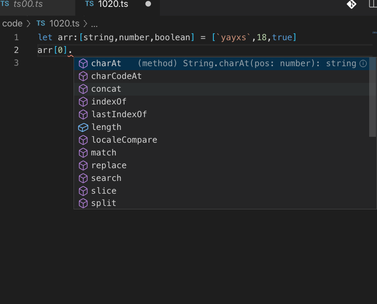

---

# TypeScript 学习启示录 （2020 版）

## TS 背景

### 类似 JS

- 不适合开发大型项目的能力
- 非常小的标准库
- 很奇怪的语法，null 和 undefined 全部变量比较难以控制
- 自动在行尾添加分号
- 运算符，例如+
- 数组和对象的划分
- 基本类型的包装对象

### 快速发展

- ts
  - 始于 js，归于 js
  - 弱类型渐渐有点强
  - 社区更新的非常快
  - 适合大型项目的开发

## 基础数据类型

- 字符串

```ts
let name: string = `yayxs`;
```

- 数字

```ts
let num: number = 16;
let num1: number = 0x10;
let num2: number = 0o20;
let num3: number = 0b10000;
```

- 布尔类型

```ts
let flag: boolean = true;
```

- 数组

```ts
// 数字数组
let arr: number[] = [1, 2, 3];

// 字符串数组
let arr: string[] = [1, 2, 3];
// 范式
let arr: Array<boolean> = [true, false];

// 啥类型都有那就是元组
```

- 元组 已知类型 已知数量

```ts
let tuple: [string, number, boolean, string];

tuple = [`yayxs`, 18, true, `nan`];

// 取值
tuple[0];
```

直接点出来，会出来相应的 API



- 枚举
  标准数据类型的一种补充，见名知意

```ts
// 枚举
enum Sex {
  Man,
  Women,
}
let sexMan: Sex = Sex.Man; // 0

let sexWo: Sex = Sex.Women; // 1

// 枚举之手动赋值
enum Sex {
  Man1 = 21,
  Women1 = 1314,
}
// 由枚举的值得到名
let sexName21: string = Sex[21];
let sexName1314: string = Sex[1314];
```

- any

```ts
let str: any = `yayxs`;
let arr: any[] = [`yayxs`, 19, 123];
```

- void 没有类型 一个函数没有返回值

```ts
let str: void = 12; // 报错
let str: void = null;
let str: void = undefined;
```

一般情况不用在变量，用在函数

```ts
function sayLove(): void {
  console.log(`I LOve You`);
}
```

- null vs undefined 所有类型的子类型

```ts
let str1: null = null;
let str1: undefined = null;
let str1: null = undefined;
```

- never 用不存在值的类型 抛出异常的函数 所有类型的子类型 没有自己的子类型
  必须存在无法存在的终点
  - 抛出异常的函数
  ```ts
  function error(msg: string): never {
    throw new Error(msg);
  }
  error(`错误`);
  ```
  - 死循环
  ```ts
  function func(): never {
    while (true) {
      console.log(`11`);
    }
  }
  ```
  - 更多的是用于底层的框架;
- object

```ts
let obj: object = {
  name: `yayxs`,
};
```

- 类型断言

```ts
let obj: any = `yayxs is `;
let str: string = obj.substr(0, 3);

let str: string = (<string>obj).substr(0, 3); // 类型断言

let str: string = (obj as string).substr(0, 3); // 类型断言
```

## 声明和解构

- var 作用域提升 一般不再使用了
- let
- const

### 解构

```ts
// 解构数组
let arr: number[] = [1, 2];
let [ele1, ele2] = arr;
// 元素交换
[ele1, ele2] = [ele2, ele1];
// 展开
let [ele1, ...other] = [1, 2, 3, 4];
console.log(other);
/**
 *
 * 解构对象
 */
enum Sex {
  Man,
  Women
}
interface Per {
  pername: string;
  perage: number;
  persex: Sex;
}

let person:Per = {name:`yayxs`,age:18,Sex.Man }


let { pername,perage,persex} = per
```

## 接口 interface

- 类似一种契约
- 核心：类型检查
- 结构性子类化
- 第三方代码契约
- 类的一部分抽象
- 对象的形状描述

```ts
interface Person {
  pername: string;
  perage: number;
}

let person: Person = {
  pername: `yayxs`,
  perage: 18,
};
```

使接口具备可选属性,对某些属性进行预定义

```ts
interface Person {
  pername?: string;
  perage?: number;
}
```

只读属性

```ts
interface Name {
  readonly myName: string;
}
```

额外的类型检查

- 使用类型断言
- 通过字符串的索引签名

```ts
interface Person {
  pername?: string;
  perage?: number;
  [propsName: string]: any;
}
```

### 函数类型接口

```ts
interface bijiao {
  (num1: number, num2: number): boolean;
}
let fn: bijiao = function(num1, num2) {
  return num1 > num2;
};
```

### 可索引类型

### 类类型

- 类中属性的约束

```ts
interface Time {
  currentTime: Date;
  setTime(day: Date);
}
class Now implements Time {
  currentTime: Date;
  constructor(hour: number, min: number) {
    console.log(hour);
  }
  setTime(day: Date) {
    console.log(day);
  }
}
```

- 类中描述一个方法
