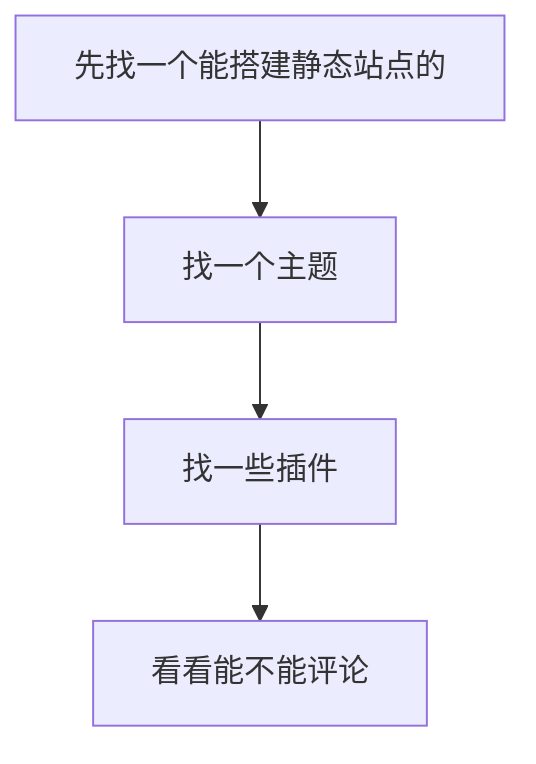
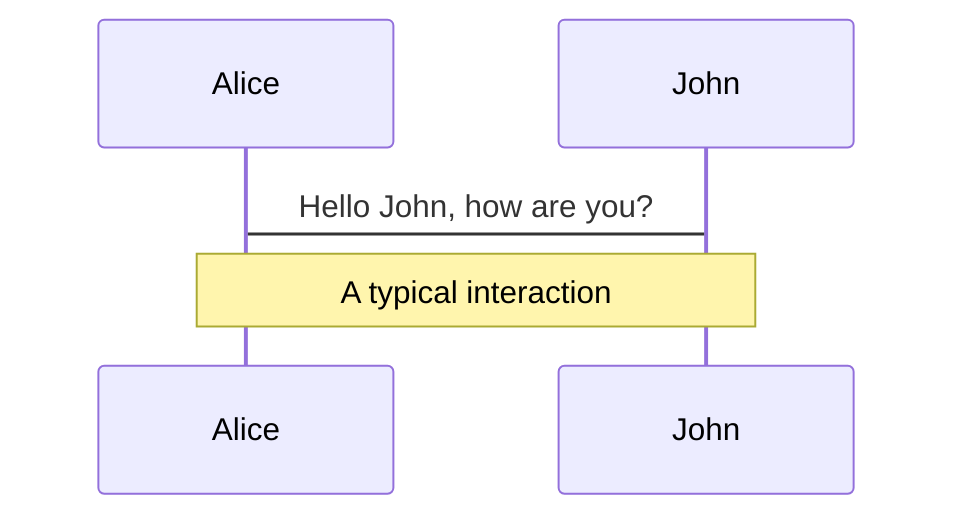
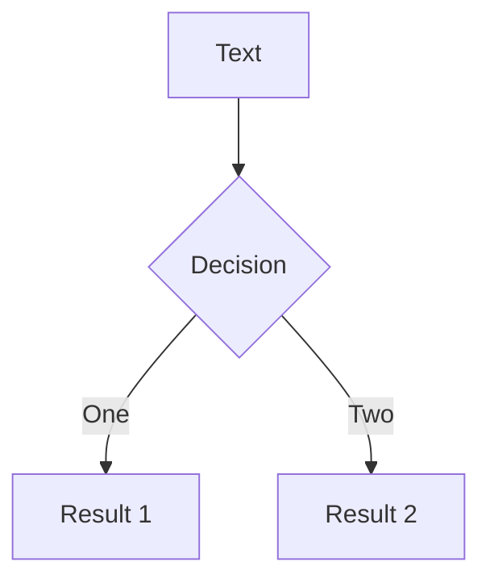

一份写好的`md` 文档，非常便捷的生成一个 web 页面，然后分享给他人。即 MD 变为 Docs。这是把一些思考记录下来很好的方式。不管是日记、笔记、读书读后感等，又或者是技术博客。
在 2022 年底 2023 年初，在了解 vite 的过程中，也用了 vitepress ，个人开发体验极佳。之前写过 `vuepress`，而`VitePress is VuePress' little brother, built on top of Vite.`
有一个自身的需求：在一个 `web页面中`，部分内容加密，有的内容不加密。由于 vitepress 目前正在处于 `alpha` 阶段，在我用 vitepress 写 文档的过程中，也没发现比较好玩的 plugin。所以我想起了很久之前，基于 `vuepress` 的一个主题

```sh
git clone https://github.com/vuepress-reco/vuepress-theme-reco-1.x
```

[https://vuepress-theme-reco.recoluan.com/views/1.x/password.html](https://vuepress-theme-reco.recoluan.com/views/1.x/password.html)

这种加密方式，一是可以对整个项目进行加密，一个是可以对项目中的某一篇进行加密

密码 123456 对应的 32 位的 md5 加密密文 `e10adc3949ba59abbe56e057f20f883e`

```js
// .vuepress/config.js vuepress 的配置文档

module.exports = {
  theme: 'reco',
  themeConfig: {
    // 密钥
    keyPage: {
      keys: ['e10adc3949ba59abbe56e057f20f883e'], // 1.3.0 版本后需要设置为密文
      color: '#42b983', // 登录页动画球的颜色
      lineColor: '#42b983', // 登录页动画线的颜色
    },
  },
}
```

我打开控制台，发现这种加密方式是 通过 class 样式 或者某种 hidden 隐藏了页面内容，但是 文档的内容还是可以看到，达不到真正加密的方式，这种实操不符合我的需求


接着，看下这部分

[https://theme-hope.vuejs.press/zh/guide/feature/encrypt.html](https://theme-hope.vuejs.press/zh/guide/feature/encrypt.html)

::: danger
警告

注意，受到 VuePress 的限制，在未解密前，文章内容仅仅被隐藏，访问者仍可以从源码中获取文章的内容。

所以请不要使用该加密功能用于任何敏感、机密的文章与档案，造成的后果请你自负
:::

看了两个主题，虽然支持对特定文件夹或特定的路径进行加密，也支持进行全局范围的加密。但是有点类似`假的加密`

顺便再说说这个主题皮肤 `reco`

```js
// Latest commit dda4e65 on Jul 21, 2020
// !! 有可能已经发生迭代
"@vuepress-reco/vuepress-plugin-back-to-top": "^1.5.4",
    "@vuepress-reco/vuepress-plugin-kan-ban-niang": "^1.0.5",
    "@vuepress-reco/vuepress-plugin-loading-page": "^1.4.0",
    "@vuepress-reco/vuepress-plugin-pagation": "^1.4.7",
    "@vuepress-reco/vuepress-plugin-screenfull": "^1.0.1",
```

整体的思路是



上述的插件是 2020 年的时候，有可能现在已经迭代了

## hexo

```sh
A fast, simple & powerful blog framework, powered by Node.js.
一个快速、简单且功能强大的博客框架，由 Node.js 提供支持。
```

> Hexo 是一个快速、简洁且高效的博客框架。Hexo 使用 Markdown（或其他渲染引擎）解析文章，在几秒内，即可利用靓丽的主题生成静态网页。

在探索 文档加密过程中，我简单根据文档，跑了一个`demo`

```sh
.
├── _config.yml # 配置文件
├── package.json
├── scaffolds
├── source
|   ├── _drafts
|   └── _posts
└── themes
```

跑起来看了一下，默认的**theme** 不是很好看，我不是很熟悉`hexo`，关于它的加密，你可以看
[https://github.com/D0n9X1n/hexo-blog-encrypt/blob/master/ReadMe.zh.md](https://github.com/D0n9X1n/hexo-blog-encrypt/blob/master/ReadMe.zh.md)

## vuepress

在很早，我出过一期视频，讲的是怎么配置`vuepress`。放到现在来看仍有参考意义。在 `vuepress` 文档中，有关当下几个静态站点生成的方案，有个横向对比

[https://v2.vuepress.vuejs.org/zh/guide/#%E4%B8%BA%E4%BB%80%E4%B9%88%E4%B8%8D%E6%98%AF](https://v2.vuepress.vuejs.org/zh/guide/#%E4%B8%BA%E4%BB%80%E4%B9%88%E4%B8%8D%E6%98%AF)

在`package.json`，文件中

```json
 "scripts": {
    "docs:dev": "vuepress dev docs",
    "docs:build": "vuepress build docs"
  },
```

这两个脚本需要特别留意一下，这在一些静态部署的网站上是需要进行 部署配置的。在 `vuepress` 跑起来之后

首页读取的是 `项目的根目录/docs/index.md` ，把这个 md 渲染在页面首页


接着就是配置`.vuepress/config.js`

```js
module.exports = {
  title: 'vitepress',
  description: 'fett',
  themeConfig: {
    nav: [
      { text: 'Guides', link: '/guides/' },
      { text: 'External', link: 'https://google.com' },
    ],
    sidebar: [
      {
        title: 'HTML', // 必要的

        collapsable: false, // 可选的, 默认值是 true,

        children: ['/guides/html/'],
      },
      {
        title: 'CSS',
        collapsable: true,
        children: ['/guides/css/'],
      },
    ],
  },
}
```

移动端的优化，在移动端，搜索框在获得焦点时会放大，并且在失去焦点后可以左右滚动，这可以通过设置元来优化。

```js

 head: [
    ['link', { rel: 'icon', href: '/favicon.ico' }],
    [
      'meta',
      {
        name: 'viewport',
        content: 'width=device-width,initial-scale=1,user-scalable=no'
      }
    ]
  ],
```

[阶段小结]

- 0、VuePress 是一个以 Markdown 为中心的静态网站生成器
- 1、现在能使用 vitepress 尽可能使用 `vitepress` ，当社区中没有你需求的插件或者能力的时候，可以使用 vuepress
- 2、不管使用 `config.ts` 或者 `config.js` 都行，在你的项目中可以轻松接入 `typescript`
- 3、尽可能多读文档，不必要不看一下相关的博客，讲怎么配置怎么配置，有时候可能会把你搞懵圈
- 4、也不必使用一些第三方的主题，除非你对文档的“华丽性” 有要求，但是这和极简的主旨恰恰相反

随着技术的更新，`vuepress` 也有了 [https://v2.vuepress.vuejs.org/](https://v2.vuepress.vuejs.org/)

```sh
git clone https://github.com/vuepress/vuepress-next
```

As Easy as 1, 2, 3

```sh
pnpm add -D vuepress@next @vuepress/client@next vue

# create a markdown file
echo '# Hello VuePress' > README.md

# start writing
pnpm vuepress dev

# build to static files
pnpm vuepress build
```

## vitepress

在说 vitepress 之前，先说说我静态文档站点踩的坑，希望对你有启发

1. 在最起初想搭建一个博客的时候，特地希望有个非常绚丽的页面，所以找了很多主题 theme，也参考了别人的一些线上的博客项目是怎么配置的
2. 没有确认博客的建立和博客的内容之前的关系，孰重孰轻，有点本末倒置
3. 没有好好的看 vuepress 的文档，刚开始的路径不对，没有好奇它是怎么工作的，是怎么把一个 md 文档变为页面

看一看仓库

[https://github.com/search?o=desc&q=vitepress&s=stars&type=Repositories](https://github.com/search?o=desc&q=vitepress&s=stars&type=Repositories)

当时在刚接触 vuepress 的时候，没有好奇 vuepress 的文档是怎么搭建的，是怎么配置的。
这次使用 vitepress 我先是找了一下，项目的根目录就有 `https://github.com/vuejs/vitepress/tree/main/docs`
以后想写文档直接参考这个配置就好

着重看这个文件 ：[vitepress/docs/.vitepress/config.ts](https://github.com/vuejs/vitepress/blob/main/docs/.vitepress/config.ts)

- lang: 值是一个字符串 ，默认是 `en-US`

```html
<!DOCTYPE html>
<html lang="en"></html>
```

- title 和 description 和上文的 lang 都是基础的配置
- cleanUrls ：'disabled' | 'without-subfolders' | 'with-subfolders'

| 模式                 |  页面   |      生成的页面 |   网址    |
| -------------------- | :-----: | --------------: | :-------: |
| 'disabled'           | /foo.md |       /foo.html | /foo.html |
| 'without-subfolders' | /foo.md |       /foo.html |   /foo    |
| 'with-subfolders'    | /foo.md | /foo/index.html |   /foo    |

themeConfig：主题的一些配置

```js
// 生成 顶部的nav 导航
function nav() {
  return [
    { text: 'Guide', link: '/guide/what-is-vitepress', activeMatch: '/guide/' },
    { text: 'Configs', link: '/config/introduction', activeMatch: '/config/' },
    {
      text: pkg.version,
      items: [
        {
          text: 'Changelog',
          link: 'https://github.com/vuejs/vitepress/blob/main/CHANGELOG.md',
        },
        {
          text: 'Contributing',
          link: 'https://github.com/vuejs/vitepress/blob/main/.github/contributing.md',
        },
      ],
    },
  ]
}
```

关于文档，我很多都是一时兴起，然后想写点什么，这种完全满足了自己的需求，能够立刻生成一个文档，后来想着

`md` `mind` 页面 就是能够在 md 里边写思维导图，可以看看这个

```sh
git clone https://github.com/mermaid-js/mermaid
```

要是使用 vitepress ,你可以看看 [CMS](https://mermaid.js.org/misc/integrations.html#cms)
其中有一个插件可以在 vitepress 中使用，这是文档 [https://emersonbottero.github.io/vitepress-plugin-mermaid/guide/getting-started.html](https://emersonbottero.github.io/vitepress-plugin-mermaid/guide/getting-started.html)

使用的案例，

这个插件能够在 vitepress 的环境中，可以在 md 文档中 写思维导图。

```js
import { defineConfig } from 'vitepress'
import { withMermaid } from 'vitepress-plugin-mermaid'

export default withMermaid(
  defineConfig({
    title: 'VitePress-starter',
    description: 'use VitePress',

    lastUpdated: true,

    mermaid: {
      // refer https://mermaid-js.github.io/mermaid/#/Setup for options
    },
  })
)
```

若果直接安装使用，会报这个错误

```js
Uncaught SyntaxError: The requested module '/@fs/D:/gh-code/vitepress-starter/node_modules/.pnpm/moment-mini@2.29.4/node_modules/moment-mini/moment.min.js?v=9ddd3ffc' does not provide an export named 'default' (at mermaid.core.mjs?v=9ddd3ffc:7:8)
```

你可以看看这个 [issues/24](https://github.com/emersonbottero/vitepress-plugin-mermaid/issues/24) 有上述问题的讨论

在`vitepress` 中和 `vuepress` 中比较友好的一点是可以直接使用 `vue组件`

[https://vitepress.vuejs.org/guide/using-vue](https://vitepress.vuejs.org/guide/using-vue)

<!-- <script setup>
import WordCloud from '../components/WordCloud.vue'
</script>

<WordCloud /> -->

要想这样使用一个组件，和写 vue 代码差不多，装一下`@antv/g2plot` 的依赖，然后在 `docs/components` 新建一个组件`WordCloud.vue`

```vue
<script lang="ts" setup>
import { onMounted, onBeforeUnmount } from 'vue'
import { WordCloud } from '@antv/g2plot'

// 渲染WordCloud
let wordCloud
onMounted(() => {
  wordCloud = new WordCloud('wordcloud-container', {
    data: [
      {
        name: 'a-name',
        value: 12,
      },
      {
        name: 'b-name',
        value: 12,
      },
    ],
    wordField: 'name',
    weightField: 'value',
    colorField: 'name',
    wordStyle: {
      fontFamily: 'Verdana',
      fontSize: [14, 35],
      rotation: 0,
    },
    // 返回值设置成一个 [0, 1) 区间内的值，
    // 可以让每次渲染的位置相同（前提是每次的宽高一致）。
    random: () => 0.5,
  })
  wordCloud.render()
})

onBeforeUnmount(() => {
  wordCloud.destroy()
})
</script>

<template>
  <div id="wordcloud-container"></div>
</template>
```

## slidev

[https://cn.sli.dev/guide/why.html#slidev](https://cn.sli.dev/guide/why.html#slidev)
[https://mermaid.js.org/intro/](https://mermaid.js.org/intro/)

如题，《Markdown 语法页面化》，上文我们大致了解了 `mermaid` 在文末我们介绍一下 `Slidev`

> Slidev 使用一种扩展的 Markdown 格式，在一个纯文本文件中存储和组织你的幻灯片。这让你专注于制作内容。

只需要 在 一个`*.md` 文件中使用 `---` 添加分隔符来分隔你的幻灯片，就能制作一页又一页的`PPT`。

```sh
git clone https://github.com/slidevjs/slidev.git
```

在 [https://github.com/slidevjs/slidev/tree/main/demo/starter](https://github.com/slidevjs/slidev/tree/main/demo/starter) 可以看一下怎么使用的

我是在之前学习 vite 时候发现的，当然了核心作者还是 `antfu Anthony Fu`，项目根目录下的 `slides.md` 是入口，如果没有的话，终端会提示 是否要新建一个 `slides.md`



---



简单的通过 md 的语法就能生成图表，真的是太炫酷了，不是吗？
